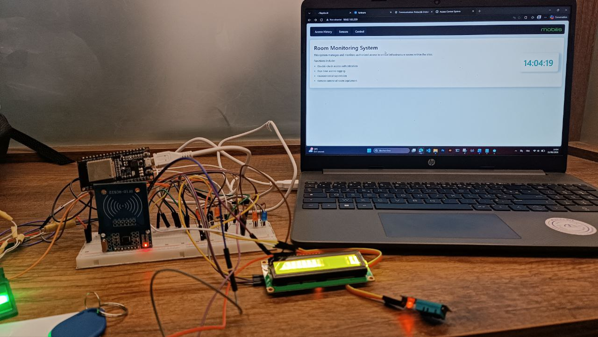
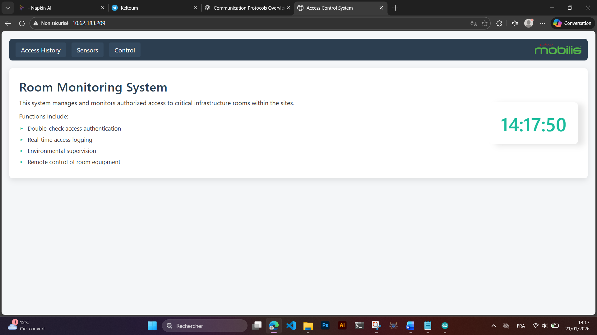

# Embedded Access Monitoring System for Telecom Technical Rooms

## Project Overview

This project was developed during my internship at Mobilis.

The goal was to design an embedded system for secure access control and environmental monitoring of critical telecom technical rooms.

## Features

* Fingerprint authentication
* RFID authentication
* Temperature and humidity monitoring
* Web dashboard supervision
* MQTT remote control

## Communication Protocols

* UART
* SPI
* I2C
* HTTP
* MQTT

## Hardware

* ESP32
* RFID RC522
* Fingerprint sensor
* LCD I2C
* DHT11

## Skills Demonstrated

* Embedded C/C++
* ESP32 programming
* IoT communication

## System Images

### Architecture

### Dashboard

* Embedded protocols
* Remote monitoring
